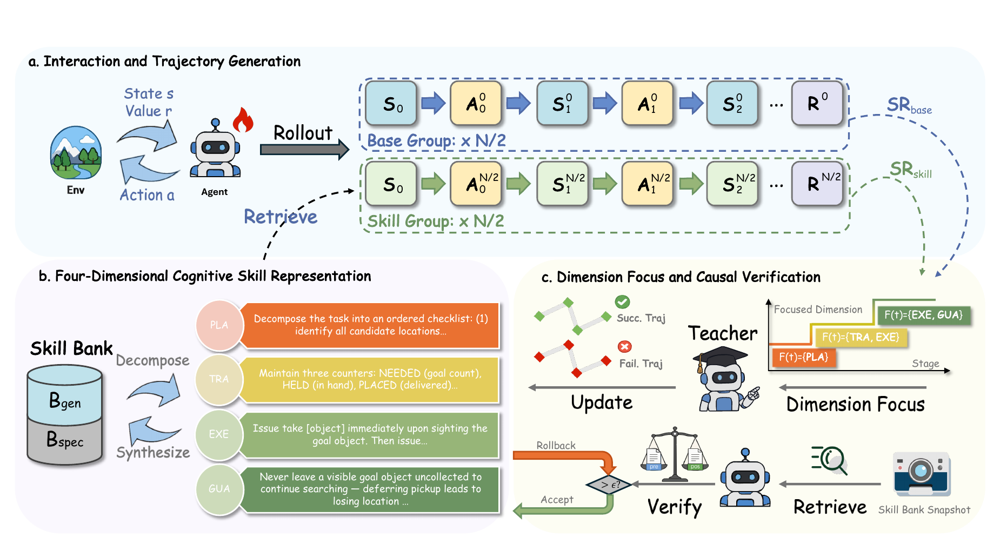

<h1 align="center">A²SE: Ability-Aligned Skill Evolution for LLM Agents via Reinforcement Learning</h1>

<p align="center">
  <strong>Official implementation of the EMNLP 2026 paper</strong>
</p>

<p align="center">
  <a href="#main-results"></a>
  <a href="https://github.com/volcengine/verl"></a>
  = 3.8">
  
</p>

<p align="center">
  Fei Huang<sup>*</sup>, Tianyu Chen<sup>*</sup>, Zhongyu He, Yuanfan Li,
  Meng Hsuan Yu<sup>†</sup>, Xingyang Li<sup>†</sup>, Lu Pan, Ke Zeng, Xunliang Cai
  <br>
  Meituan
</p>

<p align="center"><sup>*</sup>Equal contribution. <sup>†</sup>Corresponding authors.</p>

<p align="center">
  
</p>

<p align="center">
  <em>A²SE partitions rollouts into base and skill groups, represents skills along four cognitive dimensions, and evolves only the dimensions aligned with the agent's current bottleneck. Each update is causally verified and selectively rolled back when harmful.</em>
</p>

## Overview

External skill banks can accelerate agentic reinforcement learning, but existing approaches suffer from two coupled misalignments:

1. **Competence misalignment.** Skills are usually stored as monolithic text and updated without identifying whether the agent currently lacks planning, state tracking, execution knowledge, or failure prevention.
2. **Optimization misalignment.** Early in training, agents may not yet know how to use skill prompts. Under group-relative optimization, weaker skill-conditioned trajectories can therefore be penalized before the skills become useful.

**A²SE** addresses both issues by synchronizing skill evolution with the agent's learning trajectory. It combines a four-dimensional cognitive skill representation, stage-aware dimension focus, causal verification with per-task-type rollback, and a Competence-Aligned Skill Reward (CASR).

## Method Highlights

### Four-Dimensional Cognitive Skills

Each general or task-specific skill is represented through the dimensions that are relevant to it:

| Dimension | Capability | Typical content |
|---|---|---|
| **D-PLAN** | Planning and exploration | Goal decomposition, search order, and sub-goal scheduling |
| **D-TRACK** | State tracking | Object states, locations, counters, and task progress |
| **D-EXEC** | Execution details | Precise action formats and operation sequences |
| **D-GUARD** | Error guarding | Explicit constraints and common failure patterns |

The active dimensions are synthesized into a unified instruction at retrieval time, preserving concise inference context while enabling dimension-level diagnosis and updates during training.

### Ability-Aligned Evolution

A²SE estimates the agent's current ability from training performance and focuses teacher-generated updates on the dimensions most relevant to the current learning stage. Failed trajectories identify candidate bottlenecks, while successful trajectories provide contrastive evidence for reusable behavior.

### Causal Verification and Rollback

After each skill evolution step, A²SE snapshots the skill bank and re-evaluates the updated skills from controlled initial states. Updates are accepted only when they preserve or improve task performance. Verification is performed per task type, allowing useful changes to remain while locally harmful changes are rolled back.

### Competence-Aligned Skill Reward

CASR corrects the early optimization bias against skill-conditioned trajectories. It asymmetrically amplifies informative successes and softens failure penalties when skill utilization is immature, then attenuates the intervention as the skill group becomes effective and standard GRPO optimization is restored.

## Main Results

Results below use **Qwen2.5-7B-Instruct** and pure RL training without a cold-start SFT stage. Values are taken from Table 1 of the paper.

| Benchmark | Metric | GRPO | SkillRL | **A²SE** |
|---|---:|---:|---:|---:|
| ALFWorld | Success rate | 75.0 | 77.3 | **88.3** |
| WebShop | Score | 86.0 | 86.3 | **91.2** |
| WebShop | Success rate | 72.6 | 71.1 | **79.7** |

A²SE improves success rate over GRPO by **13.3 points on ALFWorld** and **7.1 points on WebShop**. Relative to SkillRL, the gains are **11.0** and **8.6** points, respectively.

### Ablation Study

| Method | ALFWorld | WebShop |
|---|---:|---:|
| **A²SE (full)** | **88.3** | **79.7** |
| w/o Four-Dim (flat skills) | 79.7 | 68.8 |
| w/o Skill Library (raw trajectories) | 60.9 | 50.8 |
| w/o Stage-Aware Focus | 82.0 | 72.7 |
| w/o Causal Verification | 81.3 | 62.5 |
| w/o CASR | 84.4 | 75.8 |
| w/o Dynamic Evolution | 74.2 | 65.5 |

The ablations show that the structured skill representation is not a post-hoc taxonomy: it is the interface that enables targeted evolution and selective verification. Causal verification is particularly important on WebShop, where harmful updates can directly alter downstream purchasing decisions.

## Code Map

| Paper component | Implementation |
|---|---|
| Multi-turn agent-environment interaction | [`agent_system/multi_turn_rollout/`](agent_system/multi_turn_rollout/) |
| Four-dimensional skill storage, retrieval, and synthesis | [`agent_system/memory/skills_only_memory.py`](agent_system/memory/skills_only_memory.py) |
| Failure attribution and dimension-constrained skill updates | [`agent_system/memory/skill_updater.py`](agent_system/memory/skill_updater.py) |
| Utility-aware skill pruning | [`agent_system/memory/skill_pruner.py`](agent_system/memory/skill_pruner.py) |
| Stage-aware scheduling, causal verification, rollback, and CASR integration | [`verl/trainer/ppo/ray_trainer.py`](verl/trainer/ppo/ray_trainer.py) |
| Initial ALFWorld and WebShop skill banks | [`memory_data/`](memory_data/) |
| Reproduction scripts | [`examples/skill_evolution_trainer/`](examples/skill_evolution_trainer/) |

## Repository Structure

```text
A2SE/
├── agent_system/
│   ├── environments/              # ALFWorld and WebShop environments
│   ├── memory/                    # Skill bank, updater, retrieval, and pruning
│   ├── multi_turn_rollout/        # Agent-environment rollout loop
│   └── reward_manager/            # Episode-level reward handling
├── examples/
│   └── skill_evolution_trainer/   # ALFWorld and WebShop launch scripts
├── memory_data/                   # Initial four-dimensional skill libraries
├── skill_generation/              # Initial skill distillation utilities
├── verl/                          # veRL-based RL training stack
├── config.sh.example              # User-specific paths and LLM gateway settings
└── figs/                          # Paper figures
```

## Installation

```bash
git clone https://github.com/CiTY-GO/A2SE.git
cd A2SE

pip install -r requirements.txt
pip install vllm==0.11.0
pip install flash-attn==2.7.4.post1 --no-build-isolation --no-cache-dir
pip install -e .
```

The training setup is built on [veRL](https://github.com/volcengine/verl) and uses vLLM for rollout generation.

## Configuration

Create a local configuration file before the first run:

```bash
cp config.sh.example config.sh
```

Then edit `config.sh` to configure the repository, model, dataset, experiment-output, and teacher-LLM paths:

| Variable | Description |
|---|---|
| `SKILLRL_ROOT` | Absolute path to this repository |
| `SKILLRL_MODEL_PATH` | Pretrained base model path, such as `Qwen2.5-7B-Instruct` |
| `SKILLRL_ALFWORLD_DATA` | ALFWorld game-data directory |
| `SKILLRL_VERL_DATA` | Generated veRL-agent parquet directory |
| `SKILLRL_EXP_BASE` | Checkpoint and TensorBoard output root |
| `SKILLRL_LLM_BACKEND` | Teacher-LLM gateway backend |
| `SKILLRL_LLM_MODEL` | Teacher model used for skill evolution |
| `SKILLRL_CATPAW_BASE_URL` / `SKILLRL_AIGC_BASE_URL` | LLM gateway endpoint |

`config.sh` is gitignored and is not committed to the repository. See [`config.sh.example`](config.sh.example) for all supported variables.

## Data Preparation

### ALFWorld

Download the [ALFWorld](https://github.com/alfworld/alfworld) game files and arrange them as follows:

```text
$SKILLRL_ALFWORLD_DATA/
└── json_2.1.1/
    ├── train/
    └── valid_seen/
```

The launch script automatically runs `examples/data_preprocess/prepare.py` when the veRL-agent parquet files are missing.

### WebShop

Create the dedicated [WebShop](https://github.com/princeton-nlp/WebShop) environment:

```bash
cd agent_system/environments/env_package/webshop
./setup.sh -d all
```

Then set `ENV_WEBSHOP` in `examples/skill_evolution_trainer/run_webshop_grpo.sh` to the resulting environment path.

## Initial Skill Banks

The repository includes the four-dimensional skill libraries used to initialize training:

```text
memory_data/
├── alfworld/claude_style_skills.json
└── webshop/claude_style_skills.json
```

Each skill stores its task type, title, applicability condition, and active subset of `D-PLAN`, `D-TRACK`, `D-EXEC`, and `D-GUARD`. Evolved skill banks are saved with timestamped filenames during training.

## Training

### ALFWorld

```bash
bash examples/skill_evolution_trainer/run_alfworld_grpo.sh [ENGINE] [GPU_NUM]
```

Example with vLLM and eight GPUs:

```bash
bash examples/skill_evolution_trainer/run_alfworld_grpo.sh vllm 8
```

### WebShop

```bash
bash examples/skill_evolution_trainer/run_webshop_grpo.sh [ENGINE] [GPU_NUM]
```

Example:

```bash
bash examples/skill_evolution_trainer/run_webshop_grpo.sh vllm 8
```

### Key Reproduction Settings

| Setting | Default | Role |
|---|---:|---|
| `env.rollout.n` | 8 | Rollouts sampled for each task group |
| `skill.ab_ratio` | 0.5 | Equal split between skill and base rollout groups |
| `skill.update_freq` | 10 | Interval between skill-bank maintenance rounds |
| `skill.verify_method` | `rollout` | Controlled rollout verification and rollback |
| `skill.focus_dims_mode` | `fixed` | Ability-conditioned dimension scheduling |
| `skill.val_episodes` | 16 | Episodes used for post-update verification |
| `trainer.total_epochs` | 150 | Total RL training epochs |

The current configuration prefix `skill.ahsr_*` is retained for compatibility with earlier experiments and controls the CASR implementation in the trainer.

Additional Hydra overrides can be appended to the ALFWorld launch command. For example, to disable verification for an ablation:

```bash
bash examples/skill_evolution_trainer/run_alfworld_grpo.sh vllm 8 \
  +skill.verify_method=notverify
```

## Outputs and Monitoring

Experiments are organized under `$SKILLRL_EXP_BASE` by benchmark and timestamp:

```text
$SKILLRL_EXP_BASE/
├── checkpoints/
│   ├── alfworld/alfworld-{MODEL}-grpo-skillevol-{TIMESTAMP}/
│   └── webshop/webshop-{MODEL}-grpo-skillevol-{TIMESTAMP}/
└── tensorboard/
    ├── alfworld-{MODEL}-grpo-skillevol-{TIMESTAMP}/
    └── webshop-{MODEL}-grpo-skillevol-{TIMESTAMP}/
```

Monitor training with:

```bash
tensorboard --logdir "$SKILLRL_EXP_BASE/tensorboard"
```

In addition to standard RL metrics, A²SE logs skill/base success rates, skill-bank size, update and pruning counts, verification outcomes, rollback counts, and CASR coefficients.

## Citation

If you find A²SE useful, please cite:

```bibtex
@inproceedings{huang2026a2se,
  title     = {Ability-Aligned Skill Evolution for LLM Agents via Reinforcement Learning},
  author    = {Huang, Fei and Chen, Tianyu and He, Zhongyu and Li, Yuanfan and Yu, Meng Hsuan and Li, Xingyang and Pan, Lu and Zeng, Ke and Cai, Xunliang},
  booktitle = {Proceedings of the 2026 Conference on Empirical Methods in Natural Language Processing},
  year      = {2026}
}
```

## Acknowledgements

This implementation is built on [veRL](https://github.com/volcengine/verl). We thank the maintainers of [ALFWorld](https://github.com/alfworld/alfworld) and [WebShop](https://github.com/princeton-nlp/WebShop) for the interactive-agent benchmarks used in this work.
